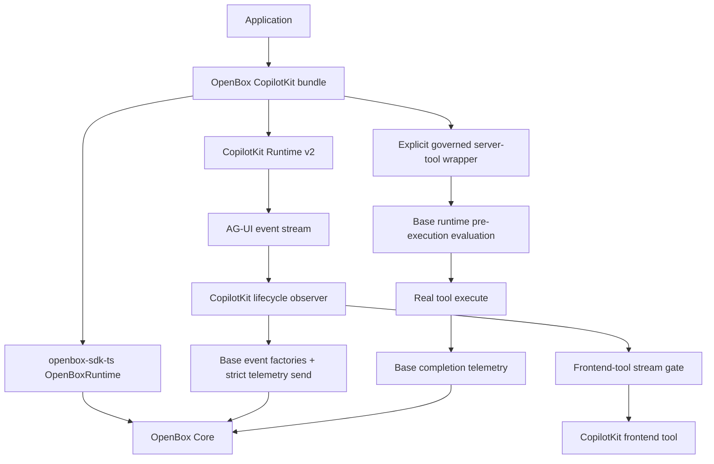

# Adopt `openbox-sdk-ts` as the Base Runtime for `openbox-copilotkit-sdk`

**Status:** Proposed
**Date:** 2026-07-16
**Target repository:** `openbox-copilotkit-sdk`
**Base dependency:** `@openbox-ai/openbox-sdk-ts`
**Proposed adapter release:** `@openbox-ai/openbox-copilotkit@0.4.0`

## 1. Decision summary

`openbox-copilotkit-sdk` should stop owning framework-neutral OpenBox behavior and
become a thin CopilotKit adapter over `@openbox-ai/openbox-sdk-ts`.

The base SDK will own:

- configuration resolution and validation;
- API-key and DID identity/signing;
- Core HTTP transport;
- event contracts and strict payload preparation;
- verdict and guardrail parsing;
- approval polling;
- runtime/context scoping;
- hook evaluation and, when explicitly enabled, Node instrumentation.

This repository will continue to own:

- CopilotKit Runtime v2 construction and request middleware composition;
- AG-UI event observation and buffering;
- CopilotKit-to-OpenBox lifecycle mapping;
- frontend-tool classification and stream gating;
- CopilotKit-native error frames;
- CopilotKit server-tool wrappers;
- CopilotKit interrupt/resume semantics;
- CopilotKit multi-agent handoff resolution and context forwarding.

The migration must also correct the current lifecycle gaps. In particular:

1. AG-UI observation must not be described as a universal server-tool
   pre-execution gate.
2. `REQUIRE_APPROVAL` must actually wait for a decision before a governed
   operation runs.
3. `RUN_FINISHED` with `outcome.type === "interrupt"` must not become
   `ActivityCompleted(status="completed")` plus `WorkflowCompleted`.
4. Telemetry-only mode must not hold the user-visible AG-UI stream behind Core
   network calls.

## 2. Context and evidence

The current adapter is `@openbox-ai/openbox-copilotkit@0.3.0`. It has no base-SDK
dependency and reimplements shared behavior under:

- `src/client/`
- `src/config/`
- `src/identity/`
- `src/types/`
- `src/governance/context.ts`
- `src/governance/approval-registry.ts`

The local base SDK checkout is `@openbox-ai/openbox-sdk-ts@1.0.0`. It already
provides the shared contracts and composition root needed by this adapter:

- root contracts and event factories;
- `./config`;
- `./client`;
- `./identity`;
- `./approvals`;
- `./adapters`;
- `./context`;
- `./runtime`;
- `./instrumentation`;
- `./conformance`.

The currently installed CopilotKit stack is:

- `@copilotkit/runtime@1.61.2`;
- `@ag-ui/client@0.0.57`;
- `@ag-ui/core@0.0.57`;
- `ai@6.0.214`.

The migration is scoped to those contracts. Supporting a newer CopilotKit/AG-UI
combination requires rerunning the compatibility suite described below.

### Dependency provenance gate

Before implementation merges, verify the published package rather than assuming
the sibling checkout represents npm:

```bash
npm view @openbox-ai/openbox-sdk-ts name version dist-tags.latest dist.integrity gitHead --json
```

The committed dependency must resolve from npm. A local `file:../openbox-sdk-ts`
link may be used during development, but it must not appear in the release
manifest or lockfile.

## 3. Goals

1. Make `@openbox-ai/openbox-sdk-ts` the only owner of shared TypeScript
   governance behavior.
2. Preserve `withOpenBoxRuntime()` as the simple CopilotKit entry point.
3. Add an explicit bundle API for adopters who need governed server tools.
4. Keep telemetry-only behavior as the default.
5. Make enforcement boundary-specific and truthful.
6. Preserve current Core payload information: workflow input/output, signal
   arguments, activity input/output, status, timings, frontend origin, goals,
   agent metadata, and multi-agent correlation.
7. Preserve one OpenBox runtime/context store per wrapped CopilotKit runtime.
8. Keep unrelated repositories unchanged.

## 4. Non-goals

- Do not modify `openbox-core`, `openbox-backend`, `openbox-sdk-ts`, or CopilotKit
  upstream as part of this migration.
- Do not copy base-SDK code into this repository.
- Do not inspect or mutate CopilotKit's private `BuiltInAgent.config` field.
- Do not claim that AG-UI stream blocking reverses or prevents an already-started
  server side effect.
- Do not claim arbitrary interception inside external/custom agents.
- Do not claim full MCP server-tool enforcement; the current CopilotKit public
  API does not expose a stable per-MCP-tool pre-execution seam to this adapter.
- Do not enable OpenTelemetry registration or global Node instrumentation merely
  by importing this package.
- Do not change the backend wire contract to accommodate adapter-local fields.

## 5. Source-of-truth order

When behavior conflicts, use this order:

1. `openbox-core` HTTP and stored wire contracts;
2. `openbox-core/docs/sdk-integration-guide.md`;
3. `openbox-sdk-python` hardened base behavior;
4. `openbox-sdk-ts` public contract;
5. current CopilotKit adapter behavior, only as compatibility evidence.

The current CopilotKit implementation is not a source of truth for signing,
auth failure semantics, verdict parsing, approval parsing, payload validation,
or instrumentation.

## 6. Target architecture



There are three distinct boundaries:

| Boundary | Adapter capability | Enforcement statement |
|---|---|---|
| Explicitly wrapped BuiltInAgent server tool | Wrapper runs before the real `execute` body | May block or await approval before the side effect |
| Explicit frontend tool | AG-UI `TOOL_CALL_END` is held before delivery to the browser | May prevent that frontend call from being delivered |
| External agent, unwrapped server tool, or MCP tool | AG-UI observation only | Telemetry only; no pre-execution guarantee |

These boundaries must be visible in types, logs, documentation, and tests.

## 7. Proposed public API

### 7.1 Simple telemetry-first API

Keep the existing entry point:

```ts
const { runtime, shutdown } = await withOpenBoxRuntime(
  { agents },
  {
    apiUrl: process.env.OPENBOX_API_URL,
    apiKey: process.env.OPENBOX_API_KEY
  }
);
```

This path remains the recommended setup for observation and frontend-tool
classification. It must not claim to hard-gate arbitrary BuiltInAgent server
tools.

### 7.2 Bundle API for governed server tools

Add a composition API that creates the base runtime before tools are declared:

```ts
const openbox = createOpenBoxCopilotKit({
  apiUrl: process.env.OPENBOX_API_URL,
  apiKey: process.env.OPENBOX_API_KEY,
  enforcement: {
    mode: "enforce",
    approvalMaxWaitMs: 15 * 60_000,
    approvalPollIntervalMs: 5_000
  }
});

const lookupOrder = openbox.serverTool(
  defineTool({
    name: "lookup_order",
    description: "Look up an order",
    parameters: orderSchema,
    execute: async (args) => lookupOrderInDatabase(args)
  })
);

const agent = new BuiltInAgent({
  model: "openai/gpt-5-mini",
  tools: [lookupOrder]
});

const { runtime, shutdown } = await openbox.withRuntime({
  agents: { default: agent }
});
```

Proposed bundle surface:

```ts
interface OpenBoxCopilotKitBundle {
  readonly openboxRuntime: OpenBoxRuntime;
  serverTool<T>(tool: T): T;
  withRuntime(options: CopilotRuntimeOptions): Promise<WithOpenBoxRuntimeResult>;
  shutdown(): Promise<void>;
}
```

`serverTool()` must wrap only tools with a real `execute` function. Interrupt
tools have no executor and remain governed through CopilotKit's interrupt/resume
lifecycle.

### 7.3 Enforcement options

Replace the ambiguous boolean with an explicit model:

```ts
interface OpenBoxEnforcementOptions {
  mode?: "telemetry" | "enforce"; // default: telemetry
  frontendTools?: "observe" | "enforce"; // default follows mode
  unwrappedServerTools?: "observe"; // intentionally no enforce value
  approvalPollIntervalMs?: number;
  approvalMaxWaitMs?: number | null;
}
```

`middlewareOptions.enforceApprovals` becomes deprecated in `0.4.0`:

- `false` maps to `mode: "telemetry"`;
- `true` maps only to frontend AG-UI enforcement and emits a warning explaining
  that server tools must be passed through `bundle.serverTool()`;
- remove the boolean in `1.0.0`.

The adapter must never silently treat `enforceApprovals: true` as universal
server-tool enforcement.

## 8. Base-SDK ownership migration

| Current CopilotKit surface | Base-SDK replacement | Action |
|---|---|---|
| `src/client/openbox-client.ts` | `@openbox-ai/openbox-sdk-ts/client` | Delete implementation; use base client through `OpenBoxRuntime` |
| `src/config/openbox-config.ts` | `@openbox-ai/openbox-sdk-ts/config` | Replace with a CopilotKit option translator and deprecated aliases |
| `src/identity/agent-identity.ts` | `@openbox-ai/openbox-sdk-ts/identity` | Delete signing implementation; use base identity/signing |
| `src/types/verdict.ts` | base `Verdict` and verdict helpers | Re-export temporarily; remove duplicate logic |
| `src/types/governance-verdict-response.ts` | base `EvaluationResult` | Replace internal use; provide a temporary deprecated type alias/facade only if compatibility tests require it |
| `src/types/guardrails.ts` | base `GuardrailsResult` | Re-export temporarily; remove duplicate parser |
| `src/types/errors.ts` | base error hierarchy | Re-export base errors; retain only CopilotKit-native control errors |
| `src/types/workflow-event-type.ts` | base `EventType` | Replace duplicate enum |
| `src/governance/approval-registry.ts` | base `ApprovalPoller` + per-runtime context | Delete process-global pending/approved registries |
| `src/governance/context.ts` | base `ActivityContext`/`ContextStore` | Replace shared lifecycle state; retain a small CopilotKit request-metadata helper only if required |
| manual payload assembly in `openbox-emitter.ts` | base event factories and strict payload preparation | Rewrite emitter as a thin adapter |
| manual hook payload assembly | base `hook()` and runtime hook evaluation | Use the base gate and span projection |
| `src/verdict/*` | base results plus CopilotKit-native constraint application | Keep only genuinely CopilotKit-specific transforms |
| `src/spans/*` | base span contracts plus CopilotKit AG-UI synthesis | Keep framework-specific synthesis; emit base-compatible `SpanRecord` |
| `src/audit/*` | no exact base equivalent | Keep only CopilotKit audit attributes; never label an observation-only event `pre_execution_*` |

### Required rule

No production file in this repository may contain a second implementation of:

- Core endpoint paths;
- auth or DID headers;
- canonical signing bytes;
- verdict alias parsing;
- approval decision parsing;
- approval poll loops;
- fail-open/fail-closed auth semantics;
- generic lifecycle validation.

Those belong exclusively to the base SDK.

## 9. Runtime composition

Add `src/copilotkit/internal/base-runtime-builder.ts`.

It will:

1. translate public CopilotKit options into `OpenBoxConfig.resolve()`;
2. set SDK identity to:
   - engine: `copilotkit`;
   - language: `typescript`;
   - version: this adapter package's version;
3. construct one base `OpenBoxClient`;
4. construct an `ApprovalPoller` only when HITL is enabled;
5. construct a CopilotKit `FrameworkAdapter`;
6. construct one `OpenBoxRuntime`;
7. optionally validate the API key before serving requests;
8. optionally install base instrumentation;
9. return an idempotent shutdown that flushes instrumentation, restores patched
   globals, closes child runtimes, and closes the base runtime.

Change `OpenBoxRuntimeController` from holding a raw client to holding the base
runtime:

```ts
interface OpenBoxRuntimeController {
  runtime: OpenBoxRuntime;
  defaults: OpenBoxRuntimeDefaults;
  logger: OpenBoxLogger;
  governedServerTools: ReadonlySet<string>;
}
```

Consumers must not call `controller.runtime.client.evaluate()` at a
pre-execution boundary. They must call `runtime.evaluateLifecycle()` or
`runtime.preflight()` so auth failures, guardrails, approvals, BLOCK, and HALT
follow the base contract.

## 10. CopilotKit framework adapter

Add `src/copilotkit/copilotkit-framework-adapter.ts` implementing the base
`FrameworkAdapter`.

Behavior:

- `handleApproval(result, context)` delegates to the configured base approval
  poller and resolves only for an allow-shaped decision;
- rejection, expiry, timeout, BLOCK, and HALT become typed
  `CopilotKitGovernanceControlError` instances;
- the server-tool wrapper catches that typed error before calling the real tool
  and makes it available to CopilotKit's error stream;
- the frontend AG-UI gate translates it to the existing redacted
  `governance_blocked` `RUN_ERROR` envelope;
- `onCompletedHookResult` may mark future work as halted/aborted but never
  claims to undo completed work.

Auth/signing/contract failures must remain fail-closed at pre-execution gates.
Do not catch them and convert them to an allow result.

## 11. Lifecycle mapping

### 11.1 Mapping table

| CopilotKit / AG-UI state | OpenBox event | Enforcement behavior |
|---|---|---|
| `RUN_STARTED` | `WorkflowStarted`, then `SignalReceived(user_input)` | Telemetry by default |
| wrapped server tool, before real `execute` | `ActivityStarted` with full args | Base runtime enforces; approval waits here |
| wrapped server tool returns | `ActivityCompleted(status=completed)` with output | Telemetry only after work |
| wrapped server tool throws | `ActivityCompleted(status=failed)` with structured error | Telemetry only after failure |
| frontend `TOOL_CALL_END` | `ActivityStarted` with buffered args | May gate before event reaches browser |
| frontend `TOOL_CALL_RESULT` | `ActivityCompleted` with output | Telemetry only |
| external/unwrapped tool events | `ActivityStarted` / `ActivityCompleted` | Clearly labeled observation only |
| successful `RUN_FINISHED` | `SignalReceived(agent_output)`, then `WorkflowCompleted` | Telemetry only |
| interrupted `RUN_FINISHED` | `SignalReceived(copilotkit_interrupt)` | No successful activity/workflow completion |
| resumed interrupt resolves | Complete the resumed activity with the resume result | Then follow the resumed run outcome |
| `RUN_ERROR` or source error | unresolved activities become failed/aborted, then `WorkflowFailed` | Terminal failure |

### 11.2 Payload rules

- `threadId` maps to `workflow_id`.
- `runId` maps to `run_id`.
- AG-UI `toolCallId` maps to `activity_id` whenever CopilotKit supplies it.
- Buffered `TOOL_CALL_ARGS` map to `activity_input`.
- `TOOL_CALL_RESULT` or server-tool return value maps to `activity_output`.
- Final assistant text maps to `SignalReceived(signal_name="agent_output")`.
- `WorkflowStarted.workflow_input` preserves the last user input.
- `WorkflowCompleted.workflow_output` preserves the aggregate final assistant
  output for a successful run.
- Error payloads use the base `ErrorInfo` shape; bare error strings are not sent.
- Framework-specific fields (`frontend`, `tool_origin`, `goal`, `agent_id`,
  `status`, timings, parent linkage) are passed through the event factory's
  `extra` object using snake_case wire keys.
- Base event `source` remains canonical. CopilotKit identity is carried by the
  SDK identity header and explicit adapter metadata, not by replacing a base
  contract constant.

### 11.3 Interrupt handling

`RUN_FINISHED` must be parsed before any pending-tool flush.

For `outcome.type === "interrupt"`:

1. identify each `interrupt.toolCallId`;
2. keep the corresponding activity pending rather than completed;
3. emit one `SignalReceived` named `copilotkit_interrupt` containing the
   interrupt IDs, reasons, messages, and response schemas after redaction;
4. do not emit `WorkflowCompleted`;
5. on a resume run, connect the resume entry back to the pending activity;
6. emit completed/aborted status according to `resume.status` and the resumed
   execution result.

If the process cannot persist pending interrupts across restarts, document that
limitation and require an injectable persistence adapter. Do not hide the gap
behind a process-global `Map` presented as durable HITL state.

### 11.4 Output deduplication

Use `SignalReceived(agent_output)` as the canonical output event.

`afterRequest` may emit output only as a fallback when the AG-UI stream did not
produce a terminal output signal. It must use a per-run deduplication key and
must not emit a second `assistant_message` signal for a normal successful run.

## 12. Server-tool enforcement

### 12.1 Required wrapper behavior

`bundle.serverTool()` wraps the real `execute` function:

```text
resolve run context
  -> build ActivityContext
  -> emit/evaluate ActivityStarted
  -> wait for approval if required
  -> bind base ContextStore activity scope
  -> execute real tool
  -> emit ActivityCompleted success/failure
  -> return/throw original result
```

The wrapper must execute the real tool exactly once.

The runtime currently forwards AI SDK execution options to the tool function at
runtime even though CopilotKit's `ToolDefinition.execute` type exposes only the
tool arguments. The implementation may use `executionOptions.toolCallId` only
behind a compatibility guard and a pinned contract test.

Rules:

- when a `toolCallId` is available, use it as `activity_id`;
- when enforcement is enabled and the required execution context is missing,
  fail safe before running the tool;
- telemetry-only mode may generate an adapter activity ID, but must mark the
  correlation as generated;
- never reflect into `BuiltInAgent.config` to discover or replace tools;
- maintain a test against every supported CopilotKit peer version proving the
  wrapper receives the expected execution context;
- if that runtime seam disappears, disable hard server-tool enforcement for
  that version rather than falling back to late AG-UI blocking.

### 12.2 Duplicate suppression

For a tool registered through `bundle.serverTool()`, the wrapper owns OpenBox
`ActivityStarted`/`ActivityCompleted`. The AG-UI observer continues forwarding
the original AG-UI events to the client but must not emit a second OpenBox
activity for the same call.

Frontend and unwrapped tool events remain owned by the AG-UI observer.

### 12.3 Nested HTTP/DB/file work

Binding `ActivityContext` around the real tool allows base instrumentation to
correlate supported nested work. It does not create universal coverage.

- fetch and supported `node:http`/`node:https` calls can be preflight-gated;
- supported async file and database operations follow base coverage;
- sync file calls are completed telemetry only;
- Redis typed commands and unsupported MongoDB operations keep the base SDK's
  documented limitations;
- arbitrary native code, child processes, external agents, and unsupported
  drivers remain outside this guarantee.

## 13. Telemetry path

Add `src/copilotkit/lifecycle-telemetry.ts`.

It will:

1. build an `EventEnvelope` with base factories;
2. prepare the payload through the base strict gate outside the network catch;
3. notify `onEvent` with the exact prepared wire payload;
4. send through `runtime.client.evaluate()` as observation only;
5. return the `EvaluationResult` for logging/late-state decisions;
6. never apply a BLOCK/HALT/REQUIRE_APPROVAL verdict to work that already ran.

Telemetry-only AG-UI forwarding must be immediate. Core sends run in an ordered
side queue, but the original AG-UI event is delivered without awaiting the
network call. At stream completion, shutdown, or explicit flush, wait for the
queued telemetry with a bounded timeout.

Pre-execution gates are the only paths allowed to hold delivery/execution while
waiting for Core.

## 14. Configuration migration

The public config will wrap `OpenBoxConfig.resolve()` with
`envPrefix: "OPENBOX_COPILOTKIT"`.

Resolution order becomes:

1. explicit adapter option;
2. `OPENBOX_COPILOTKIT_*`;
3. canonical `OPENBOX_*`;
4. compatibility aliases;
5. base defaults.

| Current option | Target | Compatibility decision |
|---|---|---|
| `apiUrl` / `OPENBOX_URL` | base `apiUrl` / `OPENBOX_API_URL` | Preserve `OPENBOX_URL` as a deprecated alias for one release |
| `apiKey` | base `apiKey` | Preserve |
| `agentDid`, `agentPrivateKey` | base identity fields | Preserve names; base validates and signs |
| `governanceTimeout` | base `timeoutSeconds` | Deprecated alias |
| `onApiError` | base `OnApiError` | Add `fail_closed_destructive` support |
| `hitlEnabled` | `config.hitl.enabled` | Deprecated flat alias |
| `skipActivityTypes` | `config.gate.skipActivityTypes` | Translate |
| `skipSignals` | `config.gate.skipSignals` | Translate |
| `skipWorkflowTypes` | `config.gate.skipWorkflowTypes` | Translate |
| `skipHitlActivityTypes` | `config.hitl.skipActivityTypes` | Translate |
| `sendStartEvent` | `config.gate.sendStartEvent` | Translate |
| `sendActivityStartEvent` | `config.gate.sendActivityStartEvent` | Translate |
| `validate` | setup-time `runtime.client.validateApiKey()` | Preserve |
| `evaluateMaxRetries` | no current base equivalent | Deprecate; do not reimplement transport retries in the adapter |
| `evaluateRetryBaseDelayMs` | no current base equivalent | Deprecate with the retry option |
| `maxEvaluatePayloadBytes` | base privacy/redaction limits | Do not blindly map bytes to character count; deprecate and document base behavior |
| `httpCapture` | current option is inert | Remove after deprecation; use explicit instrumentation options |
| `instrumentDatabases` | explicit base database list | Replace boolean with `instrumentation.databases` |
| `instrumentFileIo` | base `instrumentation.fileEnabled` | Translate only when instrumentation is explicitly installed |

### Instrumentation default

Base instrumentation remains **off by default in the CopilotKit adapter** for
`0.4.0`, preserving the current no-global-patching behavior. Enable it only via:

```ts
instrumentation: {
  enabled: true,
  databases: ["pg"],
  strict: false
}
```

When enabled, the shutdown contract is:

```text
await instrumentation.flush()
instrumentation.shutdown()
runtime.close()
```

The existing `check:no-otel` rule stays: this repository must not directly
import `@opentelemetry/*`. Importing a base-SDK subpath is allowed, but it must
not register anything until the adopter explicitly enables instrumentation.

## 15. Multi-agent migration

Keep the current CopilotKit-specific resolver and forwarding types:

- `OpenBoxMultiAgentOptions`;
- `OpenBoxSubagentHandoffConfig`;
- `OpenBoxMultiAgentContext`;
- `resolveHandoff`;
- `forwardContext`.

Replace child `OpenBoxClient` construction with child-scoped base runtimes or
base clients built from child `OpenBoxConfig` values. Cache them by child DID and
close them during bundle shutdown.

Use the base `handoff()` factory and preserve these rules:

- `from_agent_did` is the parent/orchestrator DID;
- the request is signed with the child identity when parent-side Handoff
  emission is used, allowing Core to resolve the receiving agent;
- `multi_agent_session_id` is present on parent, Handoff, and child events;
- parent activity linkage is forwarded before the child starts;
- a blocked delegation emits no Handoff;
- unwrapped delegation tools are observation-only and must not claim the child
  started after a guaranteed pre-execution handoff.

Keep the default session prefix as `mas:${runId}`. The OpenBox Mastra SDK and
`@ag-ui/mastra` derive the child's session id as `mas:${runId}` from the same
forwarded run id, so the parent must use the identical prefix; any other prefix
splits one delegated run into two OpenBox multi-agent sessions.

## 16. Public exports and compatibility

### Keep as adapter-owned exports

- `withOpenBoxRuntime`;
- `createOpenBoxCopilotKit`;
- `createOpenBoxMiddleware`;
- CopilotKit option/types;
- multi-agent option/types;
- governance blocked AG-UI error helpers;
- CopilotKit server-tool wrapper types;
- CopilotKit span-buffer types if still needed.

### Compatibility facades for `0.4.x`

Keep existing subpaths, but make them thin and deprecated:

- `./client`;
- `./config`;
- `./identity`;
- `./types`;

They may re-export base symbols or provide constructor/option translation. They
must not contain a second signer, client transport, verdict parser, or config
engine.

If a legacy API cannot be preserved without duplicating base behavior, make the
break explicit in `MIGRATION.md` rather than retaining two implementations.

Remove deprecated facades at `1.0.0`.

## 17. File-level implementation plan

### Add

- `src/version.ts`
- `src/sdk-metadata.ts`
- `src/copilotkit/create-openbox-copilotkit.ts`
- `src/copilotkit/copilotkit-framework-adapter.ts`
- `src/copilotkit/server-tool.ts`
- `src/copilotkit/lifecycle-events.ts`
- `src/copilotkit/lifecycle-telemetry.ts`
- `src/copilotkit/run-outcome.ts`
- `src/copilotkit/internal/base-runtime-builder.ts`
- `test/contract/base-sdk-provenance.test.ts`
- `test/integration/builtin-agent-server-tool-gate.test.ts`
- `test/integration/copilotkit-interrupt-resume.test.ts`
- `test/unit/copilotkit/lifecycle-telemetry-order.test.ts`
- `test/unit/copilotkit/base-sdk-ownership.test.ts`
- `MIGRATION.md`

### Modify

- `package.json`
- `package-lock.json`
- `src/index.ts`
- `src/copilotkit/index.ts`
- `src/copilotkit/types.ts`
- `src/copilotkit/with-openbox-runtime.ts`
- `src/copilotkit/openbox-emitter.ts`
- `src/copilotkit/openbox-middleware.ts`
- `src/copilotkit/internal/wrap-copilot-runtime-options.ts`
- `src/copilotkit/internal/wrap-agent-in-proxy.ts`
- `src/copilotkit/internal/before-request.ts`
- `src/copilotkit/internal/after-request.ts`
- `src/verdict/*`
- `src/spans/*`
- `src/audit/*`
- `README.md`
- `CHANGELOG.md`
- `docs/api-reference.md`
- `docs/integration-patterns.md`
- `docs/project-overview-pdr.md`
- `docs/system-architecture.md`
- `docs/troubleshooting.md`

### Delete after compatibility tests pass

- shared implementation under `src/client/`;
- shared implementation under `src/config/`;
- shared implementation under `src/identity/`;
- duplicate shared result/error/event types under `src/types/`;
- `src/governance/approval-registry.ts`;
- any process-global execution context superseded by the base per-runtime
  `ContextStore`.

Do not delete CopilotKit-native verdict constraint application merely because
the base SDK parses a verdict. The adapter still owns applying a supported
CopilotKit rewrite or emitting an explicit unsupported-verdict failure.

## 18. Delivery phases

### Phase 0 — Freeze the current contract

- Capture current public exports.
- Capture current Core payload fixtures.
- Add real BuiltInAgent tests that prove the current late-gating behavior.
- Add interrupt outcome fixtures.
- Verify the published base package and lockfile provenance.

Exit criterion: every intentional compatibility change is listed before code is
deleted.

### Phase 1 — Introduce the base composition root

- Add the base dependency.
- Add SDK metadata/version branding.
- Build `OpenBoxConfig`, `OpenBoxClient`, `ApprovalPoller`, adapter, and
  `OpenBoxRuntime` through one builder.
- Change the controller to own the base runtime.
- Implement complete idempotent shutdown.

Exit criterion: auth validation, signing, evaluate, approval polling, and
shutdown tests run through the base SDK; the old client is no longer used by the
CopilotKit path.

### Phase 2 — Migrate lifecycle envelopes

- Replace manual event-type/result classes with base contracts.
- Build lifecycle events through base factories.
- Preserve CopilotKit-specific wire fields through typed extras.
- Split enforcing evaluation from post-operation telemetry.
- Make telemetry forwarding non-blocking.

Exit criterion: golden payloads are intentionally updated, Core parity remains
valid, and the user-visible AG-UI stream does not wait for telemetry calls.

### Phase 3 — Correct terminal and approval semantics

- Implement explicit `RUN_FINISHED.outcome` handling.
- Implement approval polling through the base adapter.
- Remove fake completed statuses for unresolved calls.
- Deduplicate final output signals.
- Replace process-global approval state.

Exit criterion: interrupt, resume, approve, reject, expire, timeout, block, halt,
run error, and cancellation tests all produce truthful terminal states.

### Phase 4 — Add explicit server-tool governance

- Add the bundle API and `serverTool()` wrapper.
- Bind base activity context around real execution.
- Suppress duplicate AG-UI OpenBox activities for wrapped tools.
- Add CopilotKit/AI SDK compatibility guards.
- Keep unwrapped/MCP/external boundaries telemetry-only.

Exit criterion: a blocked or rejected wrapped server tool has an execute spy
count of zero; an approved tool executes exactly once.

### Phase 5 — Optional instrumentation and cleanup

- Add explicit instrumentation installation.
- Repoint CopilotKit tool spans to base span contracts.
- Delete shared duplicate implementations.
- Add deprecated compatibility facades.
- Update all docs and examples.

Exit criterion: package inspection proves one shared implementation, no local
base path, and no import-time global patches.

## 19. Required tests

### Base ownership and package boundaries

- No Core endpoint literal appears outside tests or the base dependency.
- No `X-OpenBox-Agent-*` header is built in this repository.
- No local verdict/approval alias parser remains.
- Root import does not install instrumentation or mutate `globalThis.fetch`.
- Published tarball contains no sibling `file:` dependency.

### Enforcement

- Wrapped server tool + ALLOW: execute exactly once.
- Wrapped server tool + BLOCK/HALT: execute zero times.
- Wrapped server tool + REQUIRE_APPROVAL then allow: poll and execute once.
- Approval rejection/expiry/timeout: execute zero times.
- Auth/signing 401/403: execute zero times even with network policy
  `fail_open`.
- Genuine network outage + `fail_open`: continue with `fallbackUsed=true`.
- Genuine network outage + `fail_closed`: execute zero times.
- Missing runtime execution context in enforce mode: fail safe.
- Unwrapped server or MCP tool: explicitly recorded as observation-only.

### Lifecycle

- `ActivityStarted.activity_input` contains parsed tool args.
- `ActivityCompleted.activity_output` contains the real tool result.
- Tool failure emits `status="failed"` and structured error.
- Successful run emits one `agent_output` signal and one
  `WorkflowCompleted`.
- Interrupted run emits no successful pending activity completion and no
  `WorkflowCompleted`.
- Cancelled resume marks the activity aborted.
- `RUN_ERROR` flushes unresolved activities as failed/aborted before
  `WorkflowFailed`.
- Parallel tool calls do not cross-correlate.
- Fifty concurrent runs retain isolated contexts.

### Streaming

- In telemetry mode, an unresolved Core evaluate promise does not prevent the
  corresponding AG-UI event from reaching the subscriber.
- In frontend enforcement mode, the frontend `TOOL_CALL_END` is withheld until
  the pre-delivery verdict resolves.
- Completion waits only for a bounded telemetry flush.

### Multi-agent

- Handoff is signed with the child identity.
- `from_agent_did` is the parent DID.
- All related events share `multi_agent_session_id`.
- A blocked delegation emits no Handoff and starts no child.
- Child runtime/cache cleanup is idempotent.

### Compatibility

- Public export snapshot for every package subpath.
- Legacy config alias tests and deprecation warnings.
- Contract test against CopilotKit Runtime 1.61.2 and AI SDK 6.0.214 proving
  the server-tool execution options required for `toolCallId` correlation.
- Unsupported peer versions disable hard server-tool claims rather than
  silently downgrading to late stream blocking.

## 20. Verification commands

Run from `openbox-copilotkit-sdk`:

```bash
npm install
npm ls @openbox-ai/openbox-sdk-ts
npm run lint
npm run typecheck
npm run test
npm run build
npm run check:no-mastra
npm run check:no-otel
npm run pack:check
git diff --check
```

Additional release checks:

```bash
npm view @openbox-ai/openbox-sdk-ts name version dist-tags.latest dist.integrity gitHead --json
npm pack --dry-run
```

Inspect the generated tarball/manifest and prove:

- base dependency is the approved published version range;
- no `file:` dependency is present;
- no source file from `openbox-sdk-ts` was copied into this package;
- package exports resolve in a clean consumer fixture;
- importing the adapter does not patch fetch, fs, DB drivers, or OTel globals.

## 21. Release and compatibility strategy

Release the migration as `0.4.0` because it changes ownership and clarifies
enforcement semantics while preserving the primary `withOpenBoxRuntime()` API.

Release sequence:

1. publish/verify the approved `@openbox-ai/openbox-sdk-ts` version;
2. merge the adapter migration with an npm dependency, not a sibling link;
3. publish `@openbox-ai/openbox-copilotkit@0.4.0` under a prerelease tag first;
4. run the CopilotKit demo and a clean consumer fixture against the packed
   artifact;
5. promote only after telemetry, server-tool, frontend-tool, interrupt/resume,
   and multi-agent scenarios pass;
6. keep `0.3.x` available as the rollback line.

The migration guide must call out:

- canonical env name changes;
- deprecated flat config fields;
- `enforceApprovals` boundary correction;
- the new server-tool wrapper;
- instrumentation remaining opt-in;
- deprecated adapter subpaths;
- interrupt semantics.

## 22. Risks and mitigations

| Risk | Mitigation |
|---|---|
| Base package metadata differs between sibling checkout and npm | Registry/provenance gate before install and release |
| Existing users import adapter-owned client/config classes | One-release thin compatibility facade plus `MIGRATION.md` |
| Base strict gate rejects a payload the old client allowed | Freeze fixtures, record conflict, follow Core/base contract rather than weakening the gate |
| Telemetry changes event ordering | Ordered side queue plus explicit bounded flush tests |
| Server-tool wrapper loses `toolCallId` on a CopilotKit upgrade | Versioned contract test, runtime guard, fail-safe disablement of hard enforcement |
| Wrapped server tool and AG-UI observer emit duplicate activities | Registry-based ownership and duplicate suppression |
| Process-global instrumentation captures the wrong runtime | Off by default; base single-runtime collision handling; explicit diagnostics |
| Interrupt state is lost on process restart | Injectable persistence or loudly documented in-memory limitation; never claim durability |
| Auth failure is swallowed by adapter code | Pre-execution paths use `OpenBoxRuntime`; explicit 401/403 regression tests |
| Multi-agent child clients leak | Child-runtime cache is closed by idempotent bundle shutdown |

## 23. Acceptance criteria

The migration is complete only when all of the following are true:

- `@openbox-ai/openbox-sdk-ts` is a published direct dependency.
- CopilotKit production code contains no duplicate shared client, signer, config
  engine, verdict parser, approval parser, or poll loop.
- The primary runtime owns one base `OpenBoxRuntime` and one per-runtime context
  store.
- Telemetry-only mode forwards AG-UI events without waiting for Core.
- `REQUIRE_APPROVAL` waits and resolves before a governed operation runs.
- A blocked/rejected wrapped server tool never executes.
- Frontend enforcement is clearly distinct from server-tool enforcement.
- Unwrapped, MCP, and external-agent calls are labeled observation-only.
- Interrupted runs do not emit successful activity/workflow completion.
- Final assistant output is emitted once.
- Activity args/output and error status are correct.
- Multi-agent handoff signing and correlation remain correct.
- Instrumentation is opt-in and fully restored on shutdown.
- All verification commands and package-consumer checks pass.
- Documentation contains no claim that blocking an AG-UI event universally
  prevents a server-side side effect.

## 24. Implementation guardrails

The implementation agent must stop and report rather than improvise when:

- the npm package version or integrity cannot be verified;
- a base event factory cannot represent a required Core field without unsafe
  manual payload mutation;
- a supported CopilotKit version does not supply the execution context needed
  for server-tool correlation;
- Core/base and current adapter fixtures disagree;
- preserving a legacy export would require keeping a second transport, signer,
  config engine, verdict parser, or approval loop;
- interrupt persistence requirements exceed process-local memory;
- an implementation step would require changing Core, backend, base SDK, or
  CopilotKit upstream.

In each case, record the exact contract conflict and request a decision. Do not
silently weaken the base gate or overstate enforcement coverage.
